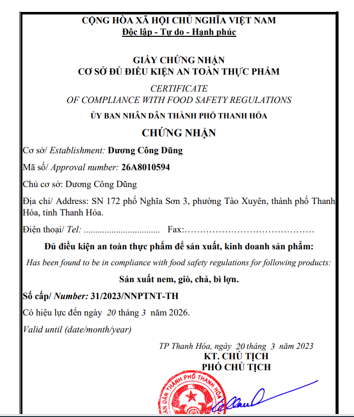

# Extract-information-from- GCN an toàn thực phẩm cấp huyện TH
The project uses Pymupdf and Ner for extract information pdf text





Dưới đây là một ví dụ README hướng dẫn chạy API này:

# Hướng dẫn chạy API

## Cài đặt

1. Cài đặt Python (phiên bản 3.7 trở lên).

2. Cài đặt các thư viện cần thiết bằng lệnh sau:

   ```bash
   pip install requirements.txt
   ```

## Chạy API

1. Clone repository từ GitHub:

   ```bash
   git clone https://github.com/Nguyendai202/Extract-information-from-pdf-text_04.git
   ```

2. Di chuyển vào thư mục chứa mã nguồn:

   ```bash
   cd your-repo
   ```

3. Chạy API bằng lệnh sau:

   ```bash
   python api.py
   ```

4. API sẽ chạy trên `http://127.0.0.1:8049`.

   
   

5. Sau khi ấn Choose File, nhập file của bạn vào và ấn Execute thì lướt xuống dưới sẽ có kết quả ở đây
   


## Sử dụng API

API này chỉ có một endpoint `/docs` nhận một hoặc nhiều văn bản pdf làm tham số đầu vào.


### Request

- Phương thức: POST
- Endpoint: `http://127.0.0.1:8049/docs`
- Header: không yêu cầu
- Body:
  - Loại: form-data
  - Key: `pdf`
  - Value: văn bản cần xử lí

### Response

Loại: String


